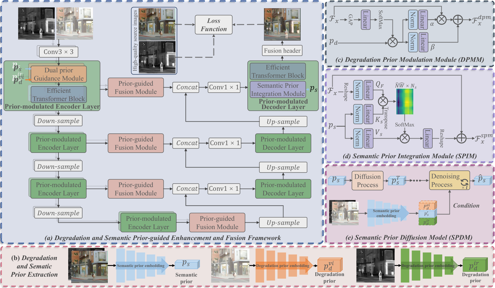
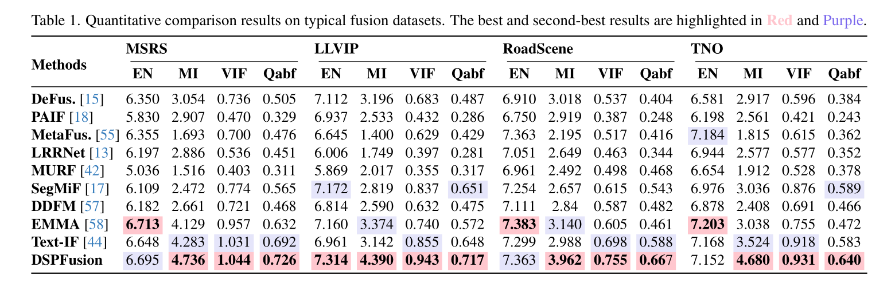
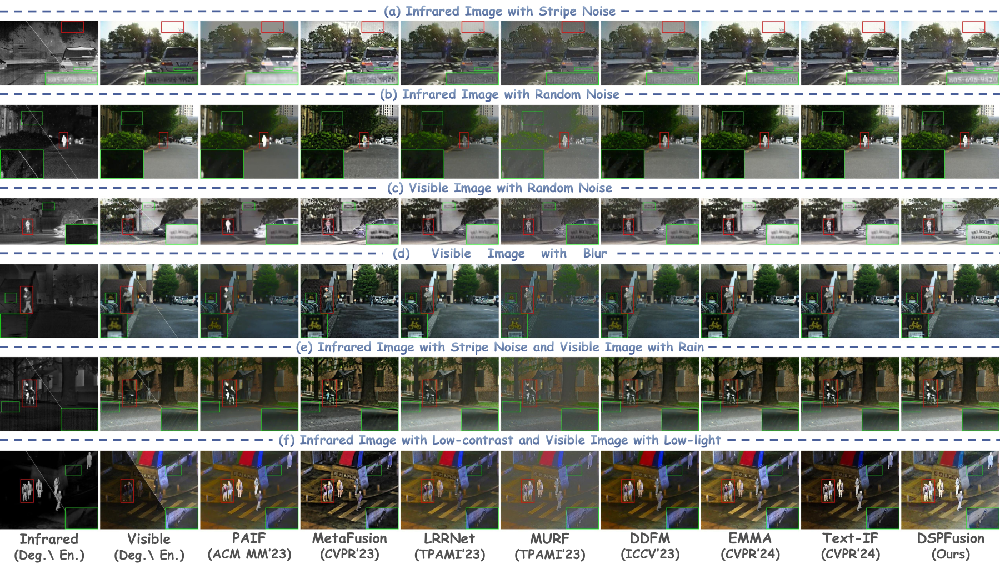

<div align="center">

# DSPFusion

### Image Fusion via Degradation and Semantic Dual-Prior Guidance

[](https://doi.org/10.1109/TIP.2026.3700938)
[](https://arxiv.org/abs/2503.23355)
[](https://www.python.org/)
[](https://pytorch.org/)

**Linfeng Tang, Chunyu Li, Yeda Wang, Guoqing Wang, Yixuan Yuan, and Jiayi Ma**

[[Paper](https://doi.org/10.1109/TIP.2026.3700938)]
[[arXiv](https://arxiv.org/abs/2503.23355)]
[[Pretrained Models](https://github.com/Linfeng-Tang/DSPFusion/releases/tag/v1.0)]

</div>

This repository is the official PyTorch implementation of **DSPFusion**, accepted as a regular paper by **IEEE Transactions on Image Processing (IEEE TIP)** on **June 2, 2026**.

## News

- **2026-06-10:** Released the cleaned training/testing code, pretrained models, and reproducibility documentation.
- **2026-06-02:** DSPFusion was accepted by IEEE TIP.
- **2025-03-30:** The preprint was released on arXiv.

## Overview

DSPFusion jointly suppresses degradations and aggregates complementary infrared-visible information. It learns modality-specific degradation priors and a shared semantic prior, restores the high-quality semantic prior through a compact latent diffusion model, and uses both priors to guide enhancement and fusion.

Key properties:

- Handles common degradations including blur, rain, low light, over-exposure, random noise, low contrast, and stripe noise.
- Uses modality-specific degradation priors to adapt restoration to each source image.
- Restores high-quality scene semantics with a lightweight semantic prior diffusion model.
- Performs restoration and fusion in one unified network without text prompts or external pre-enhancement at inference time.

## Framework



## Results

### Quantitative Comparison

The best and second-best values are highlighted in red and purple, respectively.



### Qualitative Comparison

Representative results under single and mixed degradations. More comparisons are available in the paper and supplementary material.



## Environment

The released code has been tested with Python 3.9, PyTorch 2.3.1, and CUDA-enabled NVIDIA GPUs.

```bash
git clone https://github.com/Linfeng-Tang/DSPFusion.git
cd DSPFusion

conda create -n DSPFusion python=3.9 -y
conda activate DSPFusion
pip install -r requirements.txt
```

## Pretrained Models

Download the four files from the [v1.0 release](https://github.com/Linfeng-Tang/DSPFusion/releases/tag/v1.0) and place them in `ckpt/`:

| File | Component |
| --- | --- |
| `net_g.pth` | Restoration and fusion network |
| `net_dp.pth` | Degradation prior embedding network |
| `net_sp.pth` | Semantic prior embedding network |
| `net_dm.pth` | Semantic prior diffusion model |

The expected layout is:

```text
DSPFusion/
└── ckpt/
    ├── net_g.pth
    ├── net_dp.pth
    ├── net_sp.pth
    └── net_dm.pth
```

## Data Preparation

The included sample data illustrates the required directory and filename organization. Prepare the complete dataset as follows:

```text
datasets/Hybrid_Datasets/
├── train/
│   ├── IR/
│   ├── IR_enhanced/
│   ├── VI/
│   └── VI_enhanced/
├── val/
│   ├── IR/
│   ├── IR_enhanced/
│   ├── VI/
│   └── VI_enhanced/
└── test/
    ├── ir/
    ├── vi/
    ├── ir_LC/
    ├── ir_RN/
    ├── ir_SN/
    ├── vi_Blur/
    ├── vi_LL/
    ├── vi_OE/
    ├── vi_Rain/
    └── vi_RN/
```

Update the dataset paths in `options/train/*.yml` or `options/test/*.yml` when using a different location.

## Testing

Run inference on all configured degradation conditions:

```bash
CUDA_VISIBLE_DEVICES=0 python test.py -opt options/test/DSPF_S2.yml
```

Fusion results are written to `Results/DSPF/<condition>/`.

## Training

DSPFusion uses two-stage training.

### Stage I: Prior Embedding and Fusion

```bash
CUDA_VISIBLE_DEVICES=0 python train.py -opt options/train/DSPF_S1.yml
```

After training, copy the latest Stage I checkpoints into `ckpt/`:

```bash
mkdir -p ckpt
cp experiments/DSPF_S1/models/net_g_latest.pth ckpt/net_g.pth
cp experiments/DSPF_S1/models/net_dp_latest.pth ckpt/net_dp.pth
cp experiments/DSPF_S1/models/net_sp_latest.pth ckpt/net_sp.pth
```

### Stage II: Semantic Prior Diffusion

```bash
CUDA_VISIBLE_DEVICES=0 python train.py -opt options/train/DSPF_S2.yml
```

Stage II loads the three Stage I networks from `ckpt/` and optimizes the semantic prior diffusion model. Training outputs, logs, and checkpoints are saved under `experiments/`.

## Repository Structure

```text
DSPF/        # DSPFusion architectures, datasets, models, and utilities
basicsr/     # Vendored BasicSR runtime used by the project
ldm/         # Latent diffusion components
options/     # Training and testing configurations
datasets/    # Small data samples and expected directory structure
Results/     # Representative inference outputs
train.py     # Two-stage training entry point
test.py      # Inference entry point
```

## Citation

```bibtex
@article{Tang2026DSPFusion,
  title   = {DSPFusion: Image Fusion via Degradation and Semantic Dual-Prior Guidance},
  author  = {Tang, Linfeng and Li, Chunyu and Wang, Yeda and Wang, Guoqing and Yuan, Yixuan and Ma, Jiayi},
  journal = {IEEE Transactions on Image Processing},
  year    = {2026},
  doi     = {10.1109/TIP.2026.3700938}
}
```

## Acknowledgements

This codebase builds on [BasicSR](https://github.com/XPixelGroup/BasicSR). We also thank the authors of Restormer and related diffusion-based restoration projects for their excellent work.
